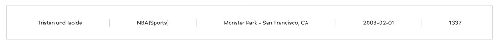

# Note

If you have any issues setting up any part of our test, please let us know so that we can assist.

# Prerequisites

Requires `docker engine 19.03.0+`.

Docker Mac Install: https://hub.docker.com/editions/community/docker-ce-desktop-mac/

Docker Windows Install: https://hub.docker.com/editions/community/docker-ce-desktop-windows/

Docker Linux Install, follow instructions for your dist: https://docs.docker.com/engine/install/

Note. Docker for Windows and Mac, includes docker compose, however on linux versions, you may need to install it separately.

See instructions for docker compose on linux here:

https://docs.docker.com/compose/install/

## Setting up the test environment with `docker-compose`

Once you have installed Docker and Docker Compose, you can go in to the root of the repo and run the following commands in your terminal:

### Building

`docker-compose build .`

### Running

`docker-compose up .`

* The application Client will be accessible on http://localhost:8080/
* The application API will be accessible on http://localhost:8880/

### Notes

Any change to the code will require a rebuild of the docker containers being either frontend or backend.

## Technical Assignment

In this assignment you will find a skeleton Events ticketing project with a React.js client, a Dropwizard API that communicate with a Postgresql database. 
The environment has been Dockerised to make it easy for you to set up.
Your tasks will be to improve upon an existing feature and to implement a new feature.
Provide your best solution and make use of appropriate React, Javascript and Java concepts to optimise and improve the codebase.

### Task One - Improve Feature

This task is to improve existing features and to make any relevant changes to the codebase.

Expected:

1. Add a Cancel button to the Category edit tab, next to the Submit button, returning to the create Category state.
2. Ensure that the Categories list is updated on Category change.
3. Create an Event named “Metal Festival” at Venue “General Motors Place” for next Sunday in a new Category called “Melodic Death Metal”.

### Task Two - Implement new feature

This task is to implement a new feature, creating a new endpoint and displaying the result in the placeholder at the bottom of the page. 
The design can be seen below and it is also included in the repository provided in path: ./task_2_design/design.jpeg.

Expected:

1. Display all details about the most recent event that has the highest number of buyers.

